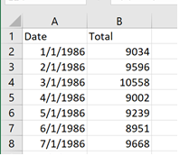

# Anomaly Detection for Univariate Time Series Using Fourier Transform and Autoencoders in Python and PyTorch

## ABSTRACT

Autoencoders are widely proposed as a method of detecting anomalies, in this project the possibility of training an autoencoder (with a univariate time series) and then submitting new isolated values to the model to detect anomalies will be explored. The problem with training an autoencoder with a time series is that the autoencoder must learn more about its trend and seasonality to make accurate predictions. There are several applications using autoencoders and Recurrent Neural Networks or RNN, (1) but they require us to provide a sequence as input. In contrast, what is often needed is to train the autoencoder once, and then feed it with new cases, not necessarily in sequence, to determine whether they are anomalies or not. This can be important, for example, in finding fraudulent transactions where the system does not necessarily analyze these transactions in the exact order of time in which they are produced.  

## THE CHALANGE OF NOT USING AN RNN

When using a Recurrent Neural Network (RNN) you must provide the network with data sequences. For example, in the sentence ‘This is a cat’ you first give to the network the word ‘This’, then ‘is’ then, then ‘a’ and finally ‘cat’. To do this with a time series you must group the data into consecutive segments that should be given to the network in the time order that they occurred. While this order of data could provide the ability to encode the trend of the time series during training, it may not provide valuable information to the network about its seasonal properties. Since in our case we do not want to use RNN (because we do not want to depend on sequences of data when asking if a new case is an anomaly), to accomplish a way must be found to provide to the network information about both seasonal and trend. 

## AN INTERESTING APPROACH 

In (2) an interesting approach is presented; the author adds to each entry, or row of the time series, additional information about its position in time in the form of sines and cosines of the day and year. The idea is to provide information that the neural network can use to learn about its seasonal characteristics. Then an LSTM is used to make forecasts. The problem is that, since in this project, an RNN is not going to be used, another way to define the position is required. 

## AN IMAGINATIVE WAY TO SET UP THE POSITION OF EACH ITEM IN A SEQUENCE 

In the seminal paper ‘Attention is all you need’ (3) the authors show a way of defining the order in a sequence by embedding in each item a series of sines and cosines which frequencies varies depending on the original position of the item, like the words in a sentence. This method has been widely validated since their network, which they named transformers, has become the main technique in developing language models.  

## THE FAST FOURIER TRANSFORM

The use of sines and cosines suggests concepts extracted from the Fourier Series. ‘All functions of a variable, whether continuous or not, can be expanded in a series of sinusoidal functions of multiples of the variable’. The Fast Fourier Transform FFT (4) is an algorithm that can be applied to decompose a time series in a sequence of complex coefficients representing different frequencies and amplitudes (this is typically known as moving from the time domain to the frequency domain). Once you have the coefficients you can, for example, filter those frequencies representing noise and then compose them back to obtain the original signal without the noise. 

## OUR APPROACH 

We use the idea in (2) of adding new fields to each item in the series but, in this case a non-linear trend, seasonality and the absolute value between the non-linear trend and the real value of the series are the ones added. To obtain these values a modification of the algorithm developed in (5) is used to calculate the FFT and then use its coefficients to predict future values. To obtain the nonlinear trend only selected coefficients are considered, this generates a smooth version of the original time series. The value that represents seasonality is calculated first by subtracting the linear trend from the time series using the NumPy polyfit function and then using more complex coefficients to reproduce the original data. 
These calculated data will be added as new columns: first column the original data, second column the nonlinear trend, third the seasonality, and fourth the difference between the nonlinear trend and the original data. The first three columns will be normalized. 
This data is then given io an autoencoder with the decoder part containing four input nodes, the compressed layer containing two nodes and the decoder reconstructing the data back to four nodes. It is expected that the autoencoder will determine the pattern provided by these elements for those entries considered normal, so this can later be used to determine anomalies. 
Once the model is calculated, together with the FFT coefficients, it is used later on to determine when new incoming data can be considered an anomaly. For that, during training, in the last epoch the mean and variance of the losses are calculated, then during evaluation losses found over 3 standard deviations from the mean are considered anomalies 

THE EXAMPLE
In (6) the author posed a challenge; finding a manual generated anomaly in a data set named catfish.csv containing a monthly time series, following there is a graph of all the data contained in the catfish.csv:

As proposed in the article (6) we are only going to use data from 1968 to 2000. Also, an anomaly will be inserted in 9/1/2000 (a 10000 value), the selected data including the generated anomaly looks like this:

The challenge of the algorithm is to try to catch the value of 10000 as the anomaly. Following is a sample of the original data:

In (6) the author posed a challenge; finding a manual generated anomaly in a data set (named catfish.csv) containing a monthly time series, following there is a graph of all the data: 
The data is divided into a training set, from 1986 to 1999, and a validation one containing only the year 2000 which will be used as the new data to be given to the model to detect the anomaly. The provided code contains a variant to also extract a testing set. The problem with not using a testing set is that we do not have a way to validate if the algorithm is performing well (decreasing the loss and not overfitting) but using a testing set will remove from training important data, specially from the last months of the time series that, in many cases are critical so, for this example no testing set was used. 

This data is given to the autoencoder that will be trained for 500 iterations (epochs) with batch size 16, this batch size is calculated using a formula. The following is the graph showing the reduction of the loss in the training set:
After using FFT to calculate complex parameters, nonlinear trends and data showing stationary patterns are calculated. The following is a graph of the calculated nonlinear trend and the data representing stationarity. 

The task of the autoencoder is trying to learn the trend and stationary pattern from this data.  
The following is the graph showing the reduction in the loss in the training set: 

Finally, when the validation set is given to the autoencoder it provides the following results: 

As seen the algorithm correctly detected the anomaly inserted. The autoencoder, while not deep, seems to learn the characteristics of the time series and in spite that the 10000 (or similar one) was present in the data during training, it flags it as an anomaly. 

